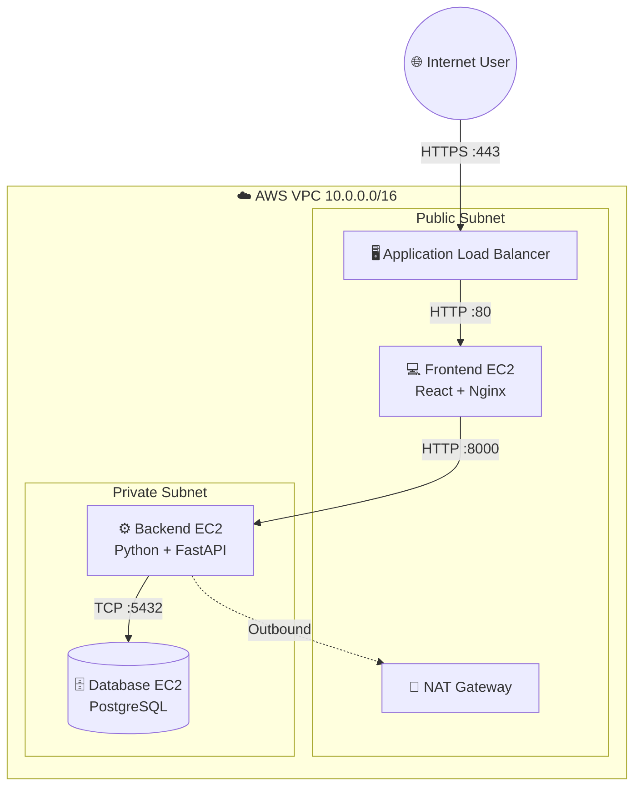

  <h1>🚀 AWS 3-Tier Enterprise Architecture with CI/CD</h1>
  
<i>A production-grade, highly secure, and automated 3-tier web application deployment on Amazon Web Services.</i>

  
  
  
  
  

---

## 📌 Overview
This project showcases a complete DevOps lifecycle and Cloud Architecture. It implements a modern **SettleMint Visitor Dashboard** using React and FastAPI, securely hosted on AWS. 

The architecture strictly follows the **Principle of Least Privilege**, utilizing public and private subnets, granular Security Groups, and an Nginx reverse proxy. Deployment is 100% automated via a custom GitHub Actions CI/CD pipeline.

## 🏗️ Architecture Design

## ✨ Key Features
- **Strict Network Isolation:** The Database and Application servers reside in a Private Subnet with no direct internet access.
- **Reverse Proxy Routing:** Nginx serves the React static files and routes `/insert` and `/records` API traffic internally to the backend.
- **Automated CI/CD:** Any push to the `main` branch triggers a GitHub Action that builds the code, SSHes into the public instance, uses it as a Jump Host to reach the private subnet, and deploys the updates automatically.
- **SSL / TLS Encryption:** Secure HTTPS traffic routed through an AWS Application Load Balancer utilizing an ACM Certificate.
- **Timezone Awareness:** Frontend automatically handles UTC conversions to PKT (Pakistan Standard Time).

## 🛠️ Technology Stack
*   **Frontend:** React (Vite), CSS3 (Glassmorphism UI)
*   **Backend:** Python 3, FastAPI, SQLAlchemy (ORM), Uvicorn
*   **Database:** PostgreSQL 16
*   **Web Server:** Nginx
*   **Cloud Infrastructure:** AWS (VPC, EC2, ALB, NAT Gateway, ACM, Route53/External DNS)
*   **Automation:** GitHub Actions (Appleboy SSH/SCP)

## 🚀 The CI/CD Pipeline
This repository contains a sophisticated `.github/workflows/deploy.yml` pipeline that solves the "Private Subnet Deployment" challenge:
1. Builds the Vite React application.
2. Uses `scp-action` to securely push the `dist/` folder to the Public Frontend EC2.
3. Uses `ssh-action` with a **ProxyJump (Bastion Host)** to securely push the Python code directly to the Private Backend EC2 without exposing it to the internet.
4. Restarts `nginx` and `uvicorn` seamlessly.

## 📚 Documentation
For a complete, "baby-steps" guide on how every single AWS component was clicked, configured, and troubleshot from scratch, please read the included [3_tier_architecture_guide.md](./3_tier_architecture_guide.md) file.
